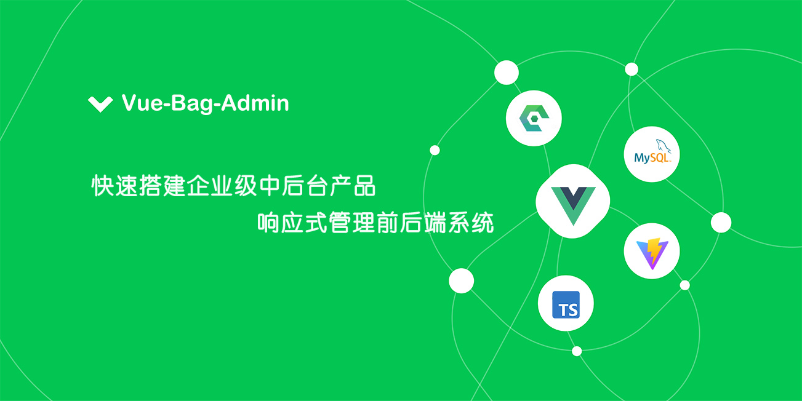

> Bag快速开发管理系统、门户网站、博客系统框架，提供基础的框架，快速搭建企业产品，响应式开发，你可以将它应用在任何需要服务端管理的应用。如：开发管理系统的 API 接口、门户网站博客、企业内部的业务管理、ERP、CMS、APP 的后台等

## 说明

> Bag管理系统采用Vue3、Vue-Router4、Vuex4、Ant-Design-Vue、Vite、TypeScript、Egg.js、Mysql构建
>
>Bag门户博客前台采用Vue3、Vue-Router4、Vite 、Pinia、Element-plus、Equal-Vue、Bootstrap、Vite、TypeScript、Egg.js、Mysql构建，按需加载模块，内置丰富UI


### 安装

```bash
npm i vue-bag-admin --save
```

### 在线演示

[管理系统演示](http://localhost:3000)、[门户博客前台演示](http://localhost:3000)


### 快速开发
>管理系统、门户博客前台代码都是同一安装包、使用同一个服务


### 适用人群
>正在以及想使用框架快速开发网站系统，有过前端开发经验 1 年+
>
>熟悉 Vue.js 技术栈，使用它开发过几个实际项目，热爱技术，爱学习，想进阶和提升的同学

### 开源免费
`vue-bag-admin`，基础框架免费开源可商用，遵循MIT开源协议，源码开放无后门，安全保障

### 版权信息
`vue-bag-admin`，是开源免费的，遵循MIT开源协议，意味着您无需支付任何费用，也无需授权，即可将它应用到您的产品中。
