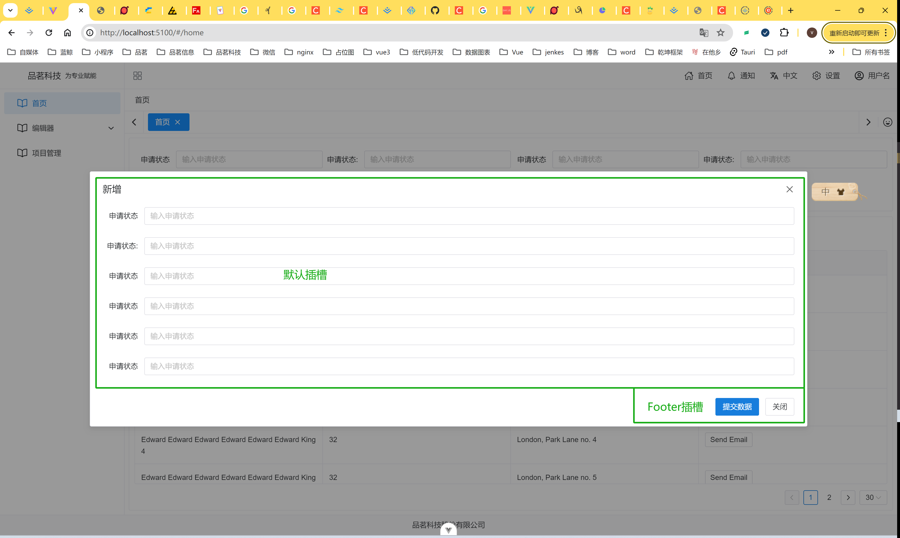

# 表单组件

框架内置的全局组件，可以直接使用

## BagGlobalForm组件

在编辑、新增的表单过程中，同时支持弹窗模式、抽屉模式、标签模式



```vue

<template>
    <div class="h-full flex flex-col">
        <n-card content-style="padding:24px 10px 0px 10px">
            <n-form ref="formRef" inline :label-width="80" :model="formValue" :rules="rules" label-placement="left"
            >
                <n-grid responsive="screen" cols="1 s:1 m:2 l:2 xl:4 2xl:6">
                    <n-gi>
                        <n-form-item label="申请状态" path="user.name">
                            <n-input v-model:value="formValue.name" placeholder="输入申请状态"/>
                        </n-form-item>
                    </n-gi>
                    <n-gi>
                        <n-form-item label="申请状态:" path="user.name">
                            <n-input v-model:value="formValue.name" placeholder="输入申请状态"/>
                        </n-form-item>
                    </n-gi>
                    <n-gi>
                        <n-form-item label="申请状态" path="user.name">
                            <n-input v-model:value="formValue.name" placeholder="输入申请状态"/>
                        </n-form-item>
                    </n-gi>
                    <n-gi>
                        <n-form-item label=" ">
                            <n-space>
                                <n-button attr-type="button" type="success">查询</n-button>
                                <n-button attr-type="button">重置</n-button>
                            </n-space>
                        </n-form-item>
                    </n-gi>
                </n-grid>
            </n-form>
        </n-card>
        <n-card content-style="padding:10px" header-style="padding:10px" style="margin-top: 10px;flex: 1">
            <template #header>
                <n-space>
                    <n-button type="primary" @click="handleClick(true)">新增数据</n-button>
                    <n-button dashed type="error">批量删除</n-button>
                    <n-button type="success" @click="handleSkip($global)">跳转路由</n-button>
                </n-space>
            </template>
            <n-data-table flex-height class="h-full min-h-[350px]" :single-line="false"
                          :columns="compTable.columns"
                          :data="compTable.data" :pagination="compTable.pagination"/>
        </n-card>
    </div>
    <bag-global-form @handleSubmit="handleSubmit" :modal="compTable.modal" v-model:showModal="compTable.showModal">
        <n-form
            ref="formRef"
            inline
            :label-width="80"
            :model="formValue"
            :rules="rules"
            label-placement="left"
        >
            <n-grid x-gap="12" :cols="1">
                <n-gi>
                    <n-form-item label="申请状态" path="user.name">
                        <n-input v-model:value="formValue.name" placeholder="输入申请状态"/>
                    </n-form-item>
                </n-gi>
                <n-gi>
                    <n-form-item label="申请状态:" path="user.name">
                        <n-input v-model:value="formValue.name" placeholder="输入申请状态"/>
                    </n-form-item>
                </n-gi>
                <n-gi>
                    <n-form-item label="申请状态" path="user.name">
                        <n-input v-model:value="formValue.name" placeholder="输入申请状态"/>
                    </n-form-item>
                </n-gi>
            </n-grid>
        </n-form>
    </bag-global-form>
</template>
<script setup>
import {NButton} from "naive-ui"

const formValue = reactive({})
const compTable = reactive({
    data: Array.from({length: 46}).map((_, index) => ({
        key: index,
        name: `Edward Edward King ${index}`,
        age: 32,
        address: `London, Park Lane no. ${index}`
    })),
    modal: {
        title: '新增',
    },
    showModal: false,
    columns: [{title: 'Name', key: 'name'}, {title: 'Age', key: 'age'},
        {title: 'Address', key: 'address'},
        {
            title: 'Action',
            key: 'actions',
            render(row) {
                return h(
                    NButton,
                    {
                        size: 'small',
                        onClick: () => {
                            compTable.modal.title = '编辑'
                            handleClick(true)
                        }
                    },
                    {default: () => 'Send Email'}
                )
            }
        }
    ],
    pagination: {
        page: 1,
        pageSize: 30,
        showSizePicker: true,
        pageSizes: [10, 20, 50],
        onChange: (page) => {
            compTable.pagination.page = page
        },
        onUpdatePageSize: (pageSize) => {
            compTable.pagination.pageSize = pageSize
            compTable.pagination.page = 1
        }
    }
})
const rules = {}
const formRef = ref();
const handleClick = (val) => {
    compTable.showModal = val
}
const handleSkip = (ctx) => {
    ctx.router.push({path: '/md'})
}
const handleSubmit = () => {

}
</script>
```

## 属性

| 属性名       | 类型      | 默认值   | 说明     |
|-----------|---------|-------|--------|
| showModal | Boolean | false | 是否显示弹窗 |

完全继承naiveui的`n-modal`，`n-drawer`组件的属性和方法

## 第三方表单插件

- 这里我推荐使用[FormCreate](https://www.form-create.com/v3/)，FormCreate 是一个可以通过 JSON
  生成具有动态渲染、数据收集、验证和提交功能的表单生成组件。它支持 6 个 UI 框架，适配移动端，并且支持生成任何 Vue 组件

#### 安装

```bash
pnpm i @form-create/naive-ui@^3
```

- [Amis](https://aisuda.bce.baidu.com/amis/zh-CN/docs/index)  是一个低代码前端框架，它使用 JSON
  配置来生成页面，可以减少页面开发工作量，极大提升效率

#### 安装

在[GitHub](https://github.com/baidu/amis/releases)下载amis的sdk
