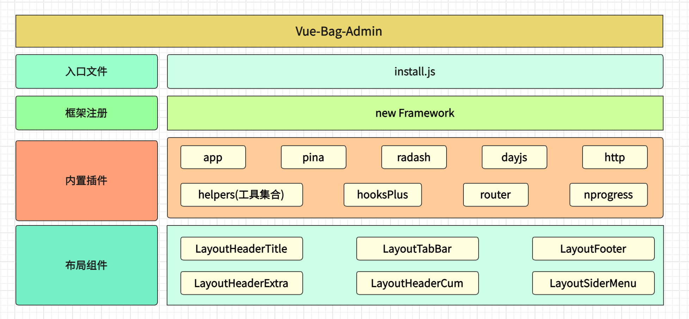

# 安装

我推荐您使用包管理器（如 NPM、Yarn 或 pnpm）安装核心基础框架，然后您就可以使用打包工具，例如 Vite 或 webpack。

## pnpm安装

```bash
npm install -g pnpm
```

## nrm安装

切换npm源地址

```bash
npm install -g nrm
nrm ls # 查看所有源地址
nrm use taobao # 切换为淘宝源
```

以下是各版本 pnpm 与各版本 Node.js 之间的兼容性表格
| Node.js | pnpm 7 | pnpm 8 | pnpm 9 |
|------------|--------|--------|--------|
| Node.js 12 | ❌ | ❌ | ❌ |
| Node.js 14 | ✔️ | ❌ | ❌ |
| Node.js 16 | ✔️ | ✔️ | ❌ |
| Node.js 18 | ✔️ | ✔️ | ✔️ |
| Node.js 20 | ✔️ | ✔️ | ✔️ |


## 安装框架

```bash
pnpm i vue-bag-admin  -S

```

```javascript
import install from "vue-bag-admin"
const {app} = install()

app.mount('#app')
```


## 架构图


