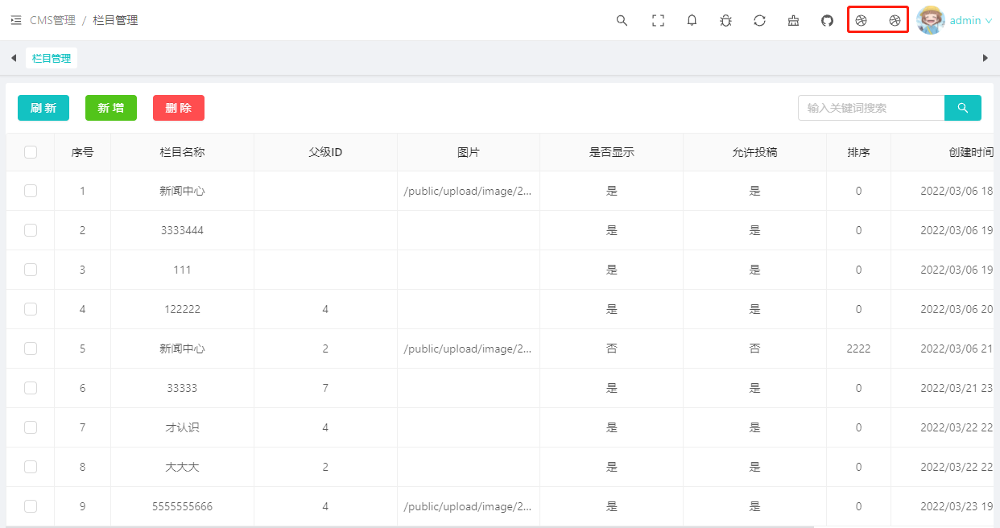

### 具体用法

```js
import ThemeBar from '@www/admin/components/ThemeBar.vue'
import install from '@/packages/install'
const $options: $optionsType = {
    layout: {
        themeBar: shallowRef(ThemeBar),
    },
}
app.use(install, $options).mount('#app')
```


#### themeBar

?>自定义添加头部菜单icon配置


