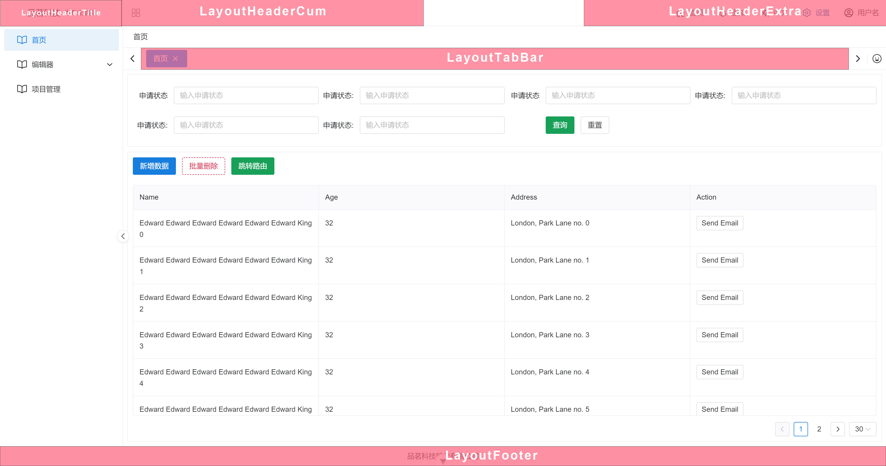

# 布局插件

通过`useLayoutPlugin`，统一处理布局组件，并注册到全局，只需要注册，框架会自动读取

```javascript
import LayoutHeaderExtra from "@/app/components/LayoutHeaderExtra.vue"
import LayoutHeaderCum from "@/app/components/LayoutHeaderCum.vue"

export default class LayoutPlugin {
    constructor() {
        this.name = 'LayoutPlugin'
    }

    install({ctx}, options) {
        ctx.app.component('LayoutHeaderExtra', LayoutHeaderExtra) // 注册布局组件
        ctx.app.component('LayoutHeaderCum', LayoutHeaderCum)  // 注册布局组件
    }
}

export const useLayoutPlugin = new LayoutPlugin()

```

## 支持全局组件

`LayoutHeaderTitle`、`LayoutTabBar`、`LayoutFooter`、`LayoutHeaderExtra`、`LayoutHeaderCum`

## 预览图


